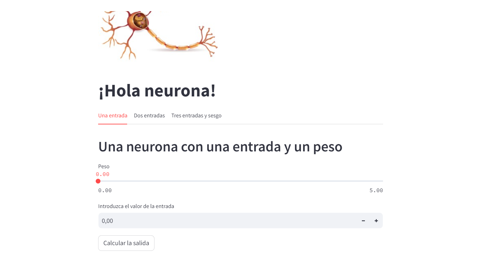

# Aplicación Hola Neurona
Aplicación con Python y Streamlit en la que se implementen los ejemplos vistos en clase:
* Una neurona con una entrada (y un peso)
* Una neurona con dos entradas
* Una neurona con tres entradas y bias (sesgo)

[URL página](https://holaneurona-dvqtavu6tatzpcmysmgr8k.streamlit.app/)

